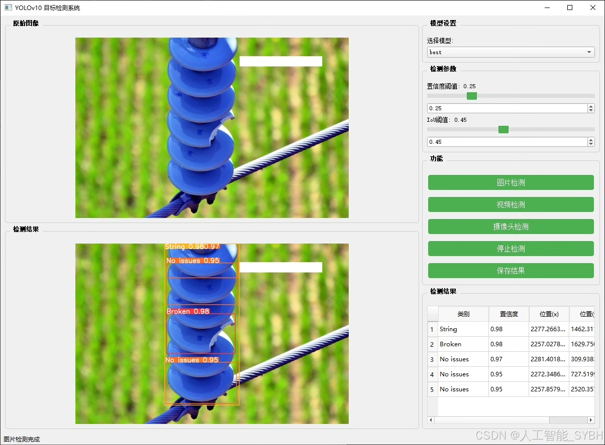
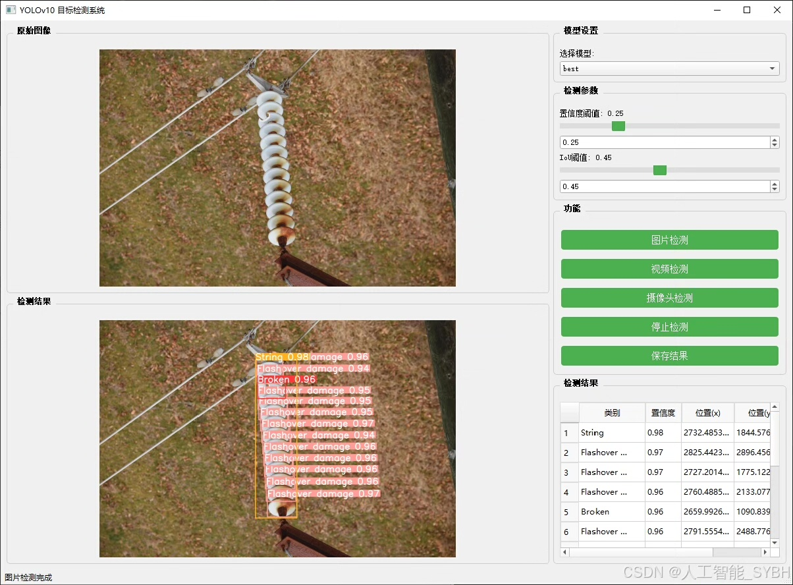
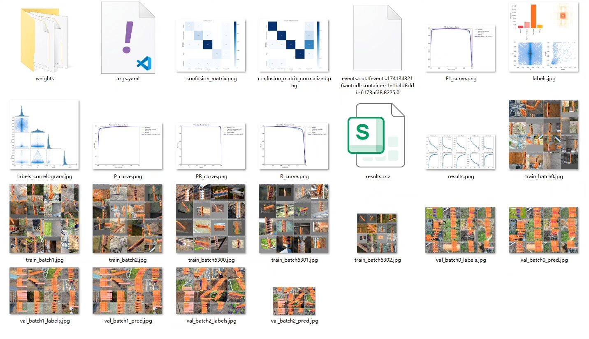
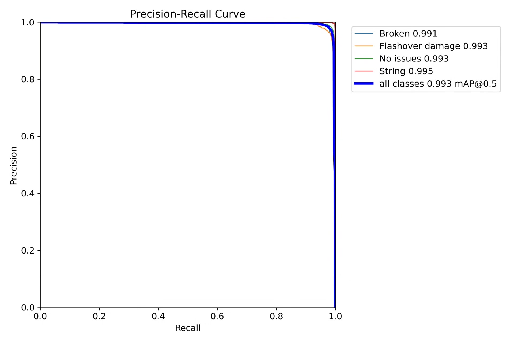
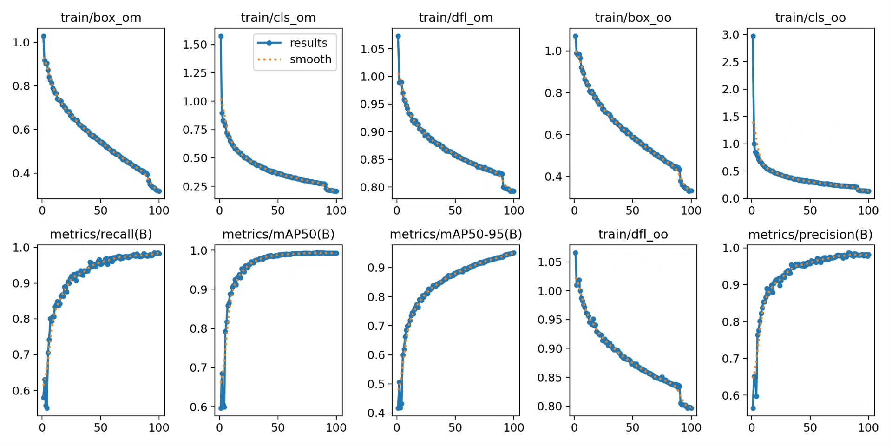
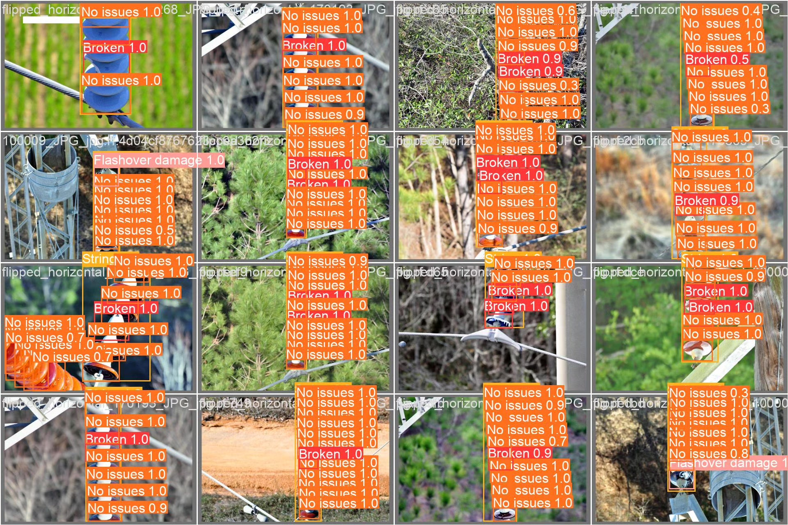
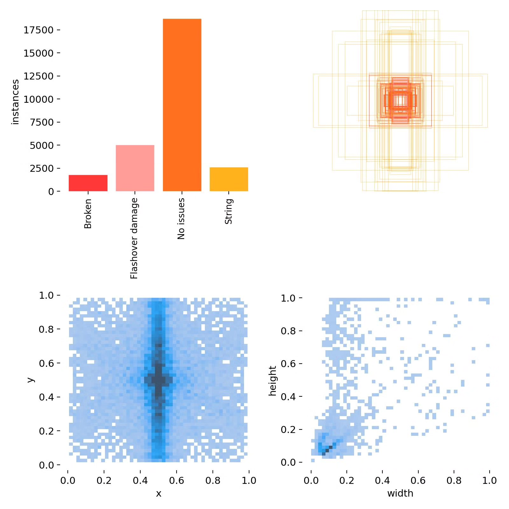
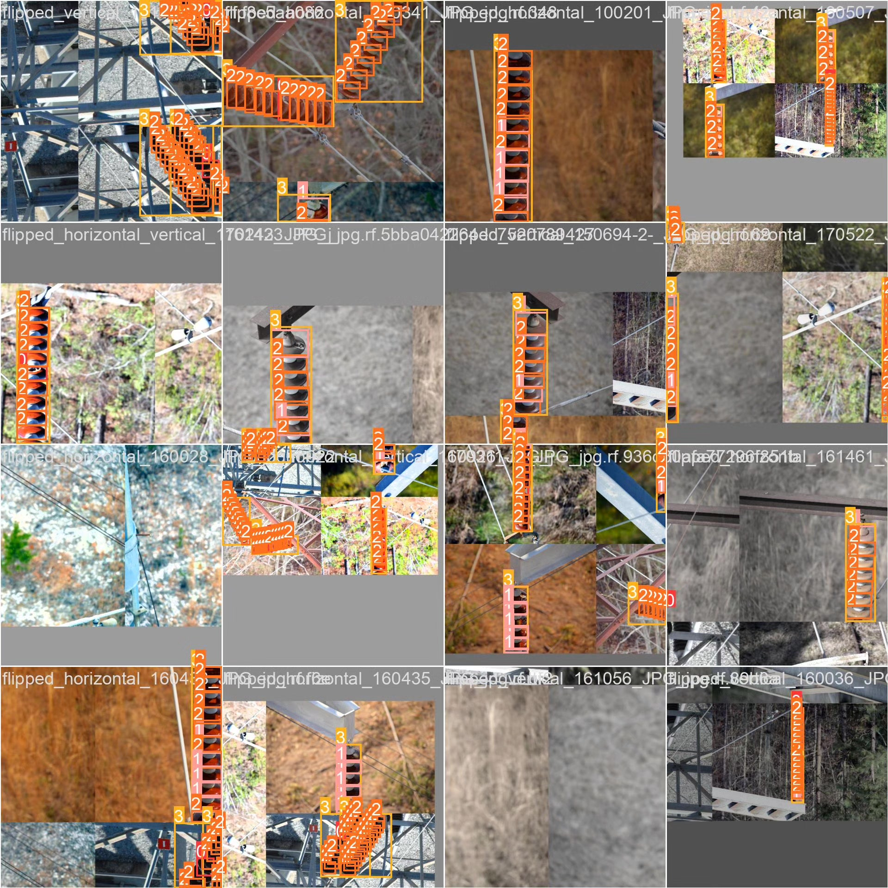

# Based on deep learning YOLOv10 for insulator defect detection system (YOLOv1)

## Body

Based on the deep learning YOLOv10, an insulator defect detection system (YOLOv10+YOLO dataset + UI interface + Python project source code + model) is developed. This project utilizes the YOLOv10 (You Only Look Once version 10) object detection algorithm to develop an efficient insulator detection system. This system can automatically detect and classify insulators from power equipment images, such as broken, flashover damaged, no problem, and insulator string, providing support for intelligent operation and maintenance of power systems.

The company's products have obtained the official commercial license certification of YOLO.

We provide after-sales service.

After payment, we will provide a WeChat account for any questions you may have at any time.

Environment configuration: We will provide a tutorial on environment configuration, and WeChat will provide answers to questions.

Remote installation service: If you need remote configuration, an additional fee of 69 is required, with all fees refunded if the configuration fails (only the installation fee is refunded for older computers).

Retraining dataset: After configuring the environment, you can train on your own computer. If you need us to retrain, just pay 69 plus computing power fees (2.5 yuan/hour).

Full after-sales service

## Images

## Payment

Here is a pay link on Stripe ( https://buy.stripe.com/3cs8yP7sY87d0vu9AB ). Please contact me lonlonago@foxmail.com after funding $89, and I will send you a complete data files , thank you!

